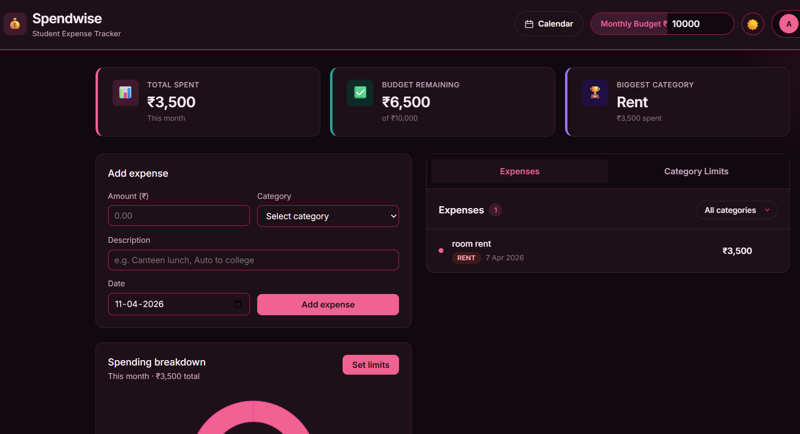

# 💸 Spendwise — Student Expense Tracker

A clean, responsive expense tracking app built for students to manage monthly budgets, visualise spending habits, and stay on top of finances.

**[Live Demo →](https://spendwise-expense-tracker-ruby.vercel.app/)**



---

## What it does

Students often have no idea where their money goes. Spendwise lets you log every expense by category, set a monthly budget, and instantly see a breakdown of your spending — so you always know what's left.

---

## Features

- **Smart onboarding wizard** — new users get a friendly 5-step setup flow to enter their name, occupation, monthly budget, and set spending limits per category
- **Personalized greetings** — animated typing greeting that shows your name with a blinking cursor
- **7 expense categories** — Food, Groceries, Transport, Entertainment, Study, Rent, and Miscellaneous
- **Add & delete expenses** — log amount, category, description, and date
- **Category filtering** — filter your expense list by any of the 7 categories
- **Spending chart** — live doughnut chart showing your breakdown by category with custom colors per category
- **Category budget limits** — set per-category spending limits and get instant warnings when you overspend
- **Budget tracker** — set a monthly budget and see exactly how much is remaining (beautiful gradient styling on dashboard)
- **Stat cards** — total spent, budget remaining, and your biggest spending category at a glance
- **Dark mode** — full dark/light toggle with your preference saved across sessions
- **Theme persistence** — your theme choice is applied globally and persists across sessions
- **Pink theme** — a custom pink & violet color system that works flawlessly in both light and dark modes
- **One-click theme switching** — modal and entire app adapt instantly to your theme preference
- **Authentication** — sign up and log in to sync expenses across devices
- **User profiles** — store your first name, last name, and occupation for a personalized experience
- **Persistent data** — all expenses, budgets, and profiles sync to Supabase in real-time
- **Success notifications** — toast feedback when expenses are added successfully
- **Error handling** — graceful error boundaries prevent crashes; friendly error messages guide recovery
- **Mobile responsive** — works on any screen size

---

## Key Highlights

### � Smart Onboarding Wizard
New users are greeted with a beautiful 5-step onboarding flow:
- **Step 1:** Enter your first name
- **Step 2:** Enter your last name
- **Step 3:** Select your occupation (Student, Professional, Freelancer, Homemaker, Job seeking, Other)
- **Step 4:** Set your monthly budget
- **Step 5:** Set spending limits for each category and choose your theme preference

The modal is fully theme-aware and adapts instantly to light/dark mode with perfect text contrast.

### 👋 Personalized Animated Greetings
After onboarding, you'll see a typing animation that spells out "Hi [FirstName]! 👋" with a blinking cursor above your expense summary — a warm welcome every time you log in.

### 💳 Enhanced Budget Bubble
The monthly budget input now has a polished gradient label, glowing shadow effect, and smooth hover transitions. It displays the ₹ currency symbol elegantly and hides the number spinners for a clean look.

### 🎯 7 Category System
Track spending across:
- Food, Groceries, Transport, Entertainment, Study, Rent, Miscellaneous

With unique color assignments for each category in the chart.

### 🔔 Real-time Category Budget Warnings
Set spending limits for each category. The app shows real-time warnings in red when you exceed a limit, helping you stay on track.

### 🎨 Universal Theme Support
Both the main app and the onboarding modal fully support light/dark mode. Your theme choice applies globally and is remembered across sessions.

### 📱 Success Notifications  
Smooth toast notifications appear briefly at the bottom of the screen when you successfully add an expense — instant visual feedback without clutter.

### 🛡️ Graceful Error Handling
If something goes wrong, you'll see a friendly error message instead of a blank screen. Hit "Reload app" to recover and continue.

### 👤 User Accounts & Profiles
Sign up or log in with your email to sync expenses across devices. Your profile stores your name, occupation, and preferences. Your data is stored securely in Supabase and recoverable anytime.

---

## Tech stack

| Tech | Purpose |
|---|---|
| React 18 | UI and component logic |
| Vite | Build tool and dev server |
| Supabase | Backend, PostgreSQL database, and authentication |
| Chart.js + react-chartjs-2 | Doughnut chart |
| CSS custom properties | Theming (light/dark) |

No external UI libraries. Full-stack with real-time data sync.

---

## Getting started

**Prerequisites:** Node.js 18+ and npm installed.

```bash
# 1. Clone the repo
git clone https://github.com/pehelalia/expense-tracker.git
cd expense-tracker

# 2. Install dependencies
npm install

# 3. Start the dev server
npm run dev
```

Open [http://localhost:5173](http://localhost:5173) in your browser.

```bash
# To build for production
npm run build
```

---

## Project structure

```
src/
├── hooks/
│   ├── useExpenses.js             # All expense state, CRUD logic, and 7 categories
│   ├── useAuth.js                 # Authentication and session management
│   ├── useCategoryBudgets.js      # Per-category budget limits
│   ├── useProfile.js              # User profile data (name, occupation)
│   └── useExpenses.js             # Export CATEGORIES array
├── components/
│   ├── ExpenseForm.jsx            # Add expense form with validation and 7 categories
│   ├── ExpenseCalendar.jsx        # Calendar view of expenses with category colors
│   ├── SPendingChart.jsx          # Chart.js doughnut chart + category limit warnings
│   ├── WelcomeModal.jsx           # 5-step onboarding wizard (theme-aware)
│   ├── Toast.jsx                  # Success notification toast
│   ├── ErrorBoundary.jsx          # Global crash handler
│   └── LoginPage.jsx              # Auth UI
├── lib/
│   └── supabase.js                # Supabase client config
├── pages/
│   └── LoginPage.jsx              # Sign up / sign in page
├── App.jsx                        # Main layout, onboarding check, typing animation
└── App.css                        # All styles + CSS variables + theme animations
```

**Database tables:**
- `profiles` — user info (first_name, last_name, occupation, onboarding_done)
- `expenses` — transaction records (amount, category, description, date, user_id)
- `category_budgets` — per-category spending limits (category, budget_limit, user_id)

---

## Supabase Setup

To enable the full onboarding experience, ensure these columns exist in your `profiles` table:

```sql
alter table profiles add column if not exists first_name text;
alter table profiles add column if not exists last_name text;
alter table profiles add column if not exists occupation text;
alter table profiles add column if not exists onboarding_done boolean default false;
```

Run this in your **Supabase SQL Editor** (Database → SQL Editor) to set up support for:
- Personalized user greetings
- Onboarding wizard detection
- User profile information

---

## Screenshots

> Add screenshots here after deploying — light mode and dark mode side by side looks great.

---

## Author

Made by [pehelalia](https://github.com/pehelalia) · 1st year B.Tech student